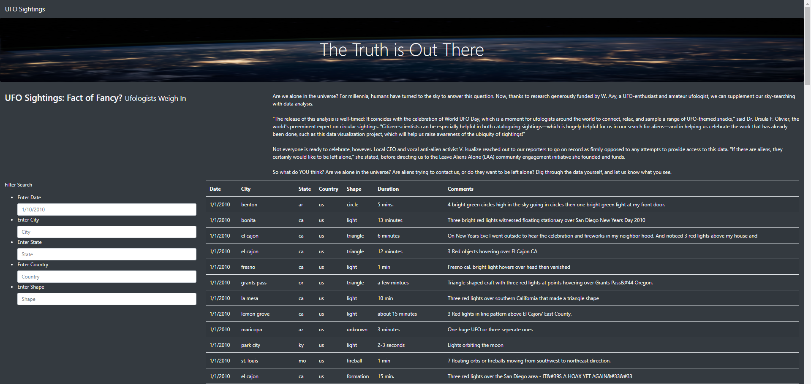
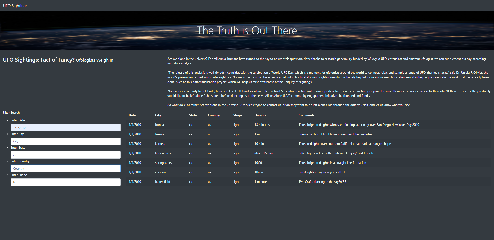

# UFOs

## Overview of Analysis
The project's purpose was to create a dynamic web page to clearly present historic UFO siting data.  

## Data Source
Data was presented in the attached javascript file [JavaScript file](static/js/data.js/)

## Built With
* Visual Studio Code
* Chrome DevTools
* JavaScript
* HTML
* Bootstrap CSS

## Results
1. Write an ETL Function to Read Three Data Files. (Python in Jupyter Notebook)
2. Extract and Transform the Wikipedia Data. (Python in Jupyter Notebook)
3. Extract and Transform the Kaggle data. (Python in Jupyter Notebook)
4. Create the Movie Database within PostgreSQL. (In pgAdmin4)

## Summary  

### Skills Learned
* Built and deployed JavaScript functions, including built-in functions.
* Converted JavaScript functions to arrow functions.
* Built and deployed forEach (JavaScript for loop).
* Created, populated, and dynamically filtered a table using JavaScript and HTML.

----------------------------------------------------------------------------------
### Appendix of Figures and Tables
----------------------------------------------------------------------------------

 
 
**Fig. 1:  Movies Query (6,052 Rows)**
 
 
 

 
 
**Fig. 2:  Ratings Query (26,024,289 Rows)**
 
 
 
